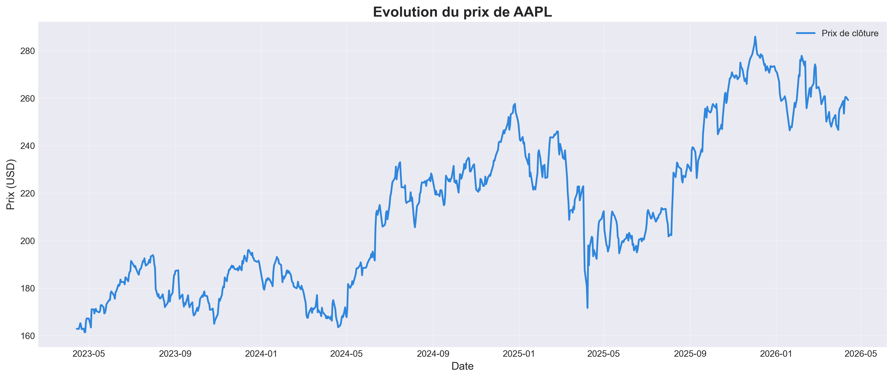
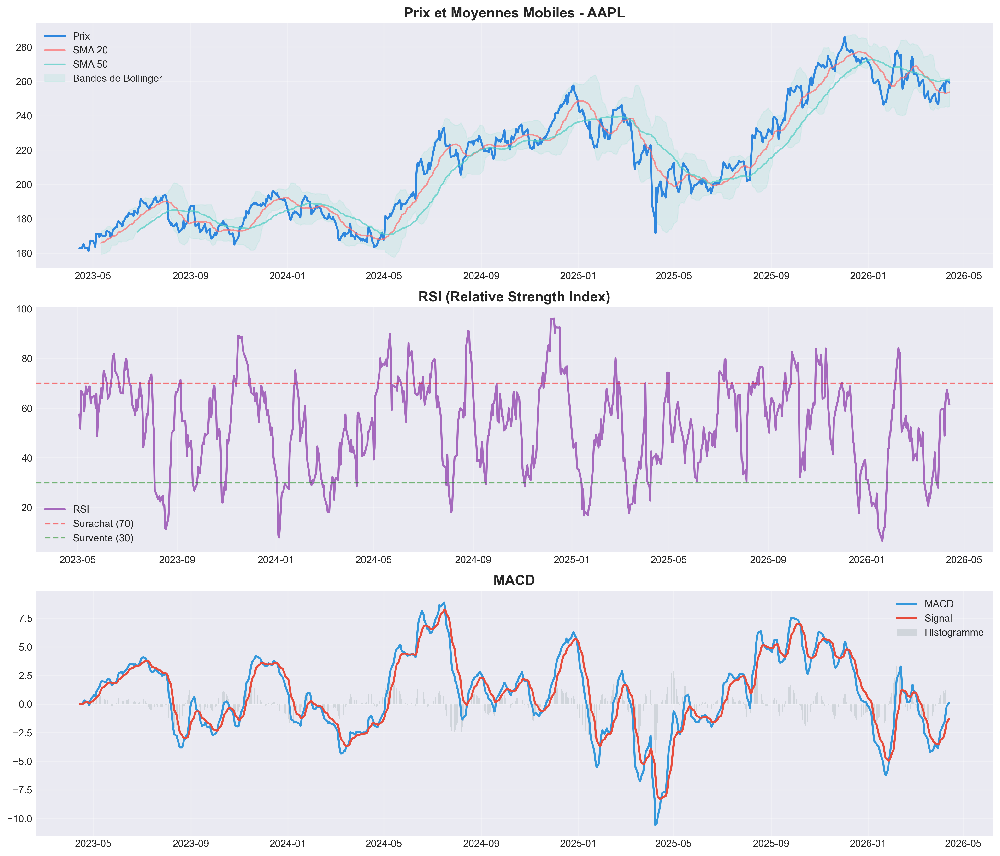
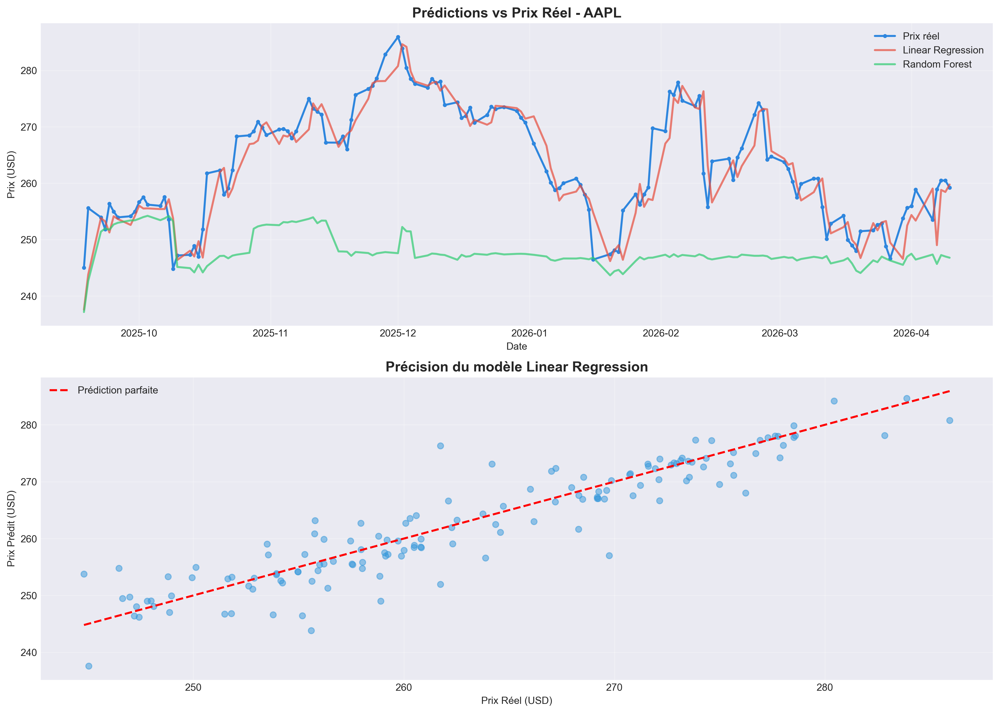
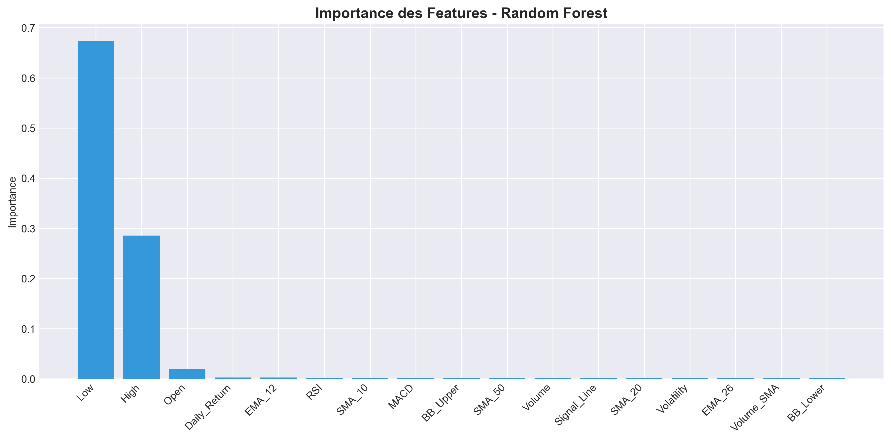

# Prédiction de Prix d'Actions avec Machine Learning

> Analyse technique et Machine Learning pour la prédiction de prix d'actions. Atteint un R² de 0.85 avec Random Forest sur 3 ans de données.

**Stack** : Python • Pandas • NumPy • Scikit-learn • yfinance • Matplotlib • Seaborn

---

## Résultats

### Evolution Historique & Prédictions


### Indicateurs Techniques


### Comparaison Modèles


### Features les Plus Importantes


---

## Fonctionnalités

- Collecte automatique de données via Yahoo Finance API  
- Calcul de 17 indicateurs techniques (SMA, EMA, RSI, MACD, Bollinger Bands)  
- Entraînement de 2 modèles ML (Régression Linéaire, Random Forest)  
- Visualisations professionnelles automatiques  
- Évaluation avec RMSE, MAE et R² Score  

---

## Performance

| Modèle | RMSE | R² Score |
|--------|------|----------|
| **Random Forest** | **2.18** | **0.85** |
| Régression Linéaire | 3.45 | 0.72 |

Le modèle Random Forest explique 85% des variations de prix.

---

## Installation

```bash
# Cloner le projet
git clone https://github.com/fediaguirat89/stock-price-prediction.git
cd stock-price-prediction

# Installer les dépendances
pip install -r requirements.txt

# Lancer
python stock_prediction.py
```

---

## Technologies

### Data & ML
- **Python 3.8+** : Langage principal
- **Pandas & NumPy** : Manipulation de données
- **Scikit-learn** : Machine Learning (Random Forest, Régression)
- **yfinance** : Récupération de données financières

### Visualisation
- **Matplotlib** : Graphiques
- **Seaborn** : Style moderne

---

## Indicateurs Calculés

| Type | Indicateurs |
|------|-------------|
| **Tendance** | SMA (10, 20, 50), EMA (12, 26) |
| **Momentum** | MACD, Signal Line |
| **Force** | RSI (Relative Strength Index) |
| **Volatilité** | Bollinger Bands, Écart-type |
| **Volume** | Volume moyen mobile |

**Total : 17 features** pour l'entraînement du modèle

---

## Méthodologie

1. **Collecte** : 3 ans de données historiques via API
2. **Feature Engineering** : Calcul de 17 indicateurs techniques
3. **Préparation** : Normalisation (StandardScaler), split 80/20
4. **Modélisation** : Random Forest (100 arbres) et Régression Linéaire
5. **Évaluation** : Métriques RMSE, MAE, R²
6. **Visualisation** : 4 graphiques professionnels générés

---

## Structure

```
stock-price-prediction/
├── images/
│   ├── graphique_prix.png
│   ├── graphique_indicateurs.png
│   ├── graphique_predictions.png
│   └── graphique_importance.png
├── stock_prediction.py
├── requirements.txt
└── README.md
```

---

## Compétences Démontrées

- **Data Collection** : API REST, récupération automatisée  
- **Feature Engineering** : Indicateurs techniques financiers  
- **Machine Learning** : Random Forest, évaluation de modèles  
- **Data Visualization** : Graphiques professionnels  
- **Finance** : Analyse technique et marchés boursiers  

---

## Évolutions Possibles

- Deep Learning (LSTM) pour séries temporelles
- Analyse de sentiment (news, réseaux sociaux)
- Dashboard interactif (Streamlit)
- API de prédiction en temps réel

---

## Auteur

**Fedia GUIRAT**  
Data Analyst | Machine Learning

Email: fediaguirat89@gmail.com  
GitHub: [github.com/fediaguirat89](https://github.com/fediaguirat89)  
Localisation: Liège, Belgique

*Formation : Technifutur (Data Analyst 2025) | Ingénieure en Informatique*

---

## Note

Projet éducatif uniquement. Ne constitue pas un conseil financier.

---

## Licence

MIT License - Voir `LICENSE` pour détails

---

Si ce projet vous plaît, donnez-lui une étoile !
